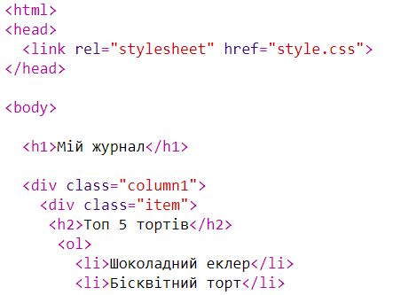
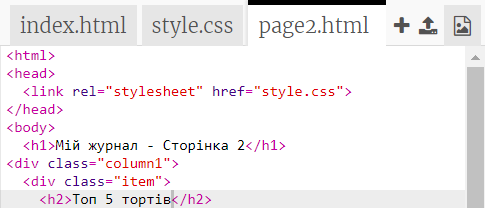
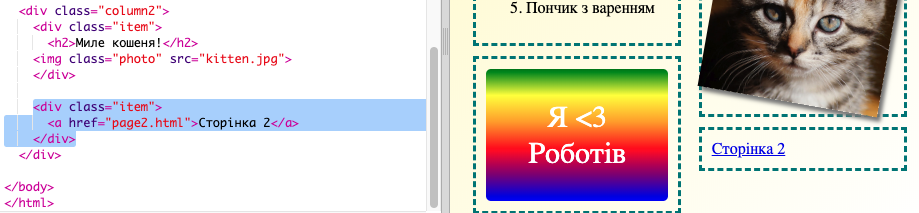

## Додай другу сторінку

Додай ще одну сторінку до свого онлайн журналу.

+ Додай нову сторінку для свого проєкту і назви її `page2.html`:

+ Сторінка 2 буде досить схожа на першу сторінку твого журналу, тому ти можеш скопіювати html з `index.html` та вставити його в `page2.html`.

Зверни увагу, що обидві сторінки використовують один і той же `style.css` тому, вони матимуть однаковий стиль.

+ Зміни заголовок `<h1>` для сторінки 2:

+ Тепер тобі потрібні посилання між сторінками, щоб ти міг (могла) переходити на сторінку 2 і повертатися назад на основну.

Повернися до `index.html`. Додай посилання всередині div у колонці 2 в `index.html`:

+ Перевір, що ти можеш натиснути на нове посилання та перейти на сторінку 2 свого журналу.