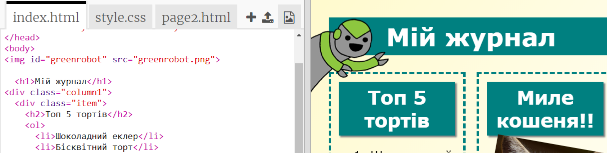
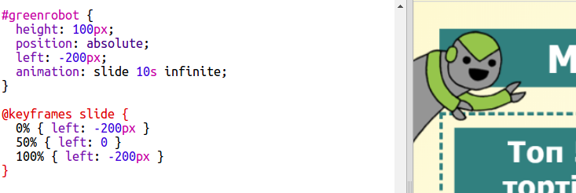

## Додайте анімацію

Додайте веселу анімацію до вашого журналу.

+ Перейдіть на `index.html` і додайте `greenrobot.png` зображення на початок сторінки.

+ Тепер додайте CSS, щоб ваш робот рухався:

