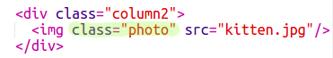

## Tạo cột

Trang web thường sử dụng nhiều cột. Hãy tạo bố cục hai cột cho tạp chí của bạn.

+ Đầu tiên tạo hai cột `div`s.
    
    Thêm HTML được tô sáng vào `index.html`:
    
    

+ Bây giờ tạo kiểu cho các div cột sao cho một cái nổi bên trái và cái kia nổi bên phải.
    
    
    
    Mỗi cột nhỏ hơn 50% nên có chỗ để đệm.
    
    Bạn sẽ cần thêm một cái gì đó vào một cột để thấy hiệu quả.

+ Chúng ta hãy thêm một hình ảnh mèo con vào đầu cột 2.
    
    
    
    Lưu ý rằng hình ảnh mèo con được định vị khoảng một nửa trên trang, trong cột thứ hai.
    
    Mặc dù nó hơi lớn!

+ Hãy sử dụng `độ rộng tối đa:` để làm cho hình ảnh vừa với thùng chứa của chúng.
    
    Thêm kiểu sau vào `style.css`.
    
    
    
    Điều này sẽ áp dụng cho tất cả các hình ảnh bạn sử dụng trong tạp chí của bạn, không chỉ con mèo con.

+ Bây giờ thêm ảnh `lớp` vào ảnh để bạn có thể tạo kiểu cho nó:
    
    

+ Và tạo kiểu cho ảnh để thêm bóng và xoắn để làm cho ảnh bật ra khỏi trang:
    
    
    
    Thực hiện một số thay đổi cho đến khi bạn thích kết quả.