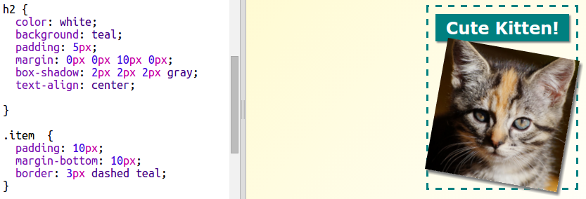

## Mục tạp chí phong cách

Hãy làm cho bố cục thú vị hơn một chút.

+ Thêm `div` xung quanh hình ảnh của bạn với `lớp` và thêm tiêu đề `h2`:
    
    

+ Bây giờ phong cách các mục và tiêu đề.
    
    Đây là một ví dụ, nhưng bạn có thể thay đổi:
    
    