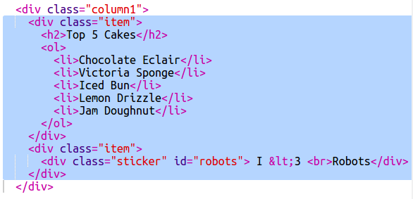

\--- thử thách \---

## Thách thức: Thêm các mục vào cột bên trái

Bạn có thể thêm một danh sách theo thứ tự và nhãn dán văn bản gradient vào cột bên trái không?

Đây là một ví dụ:

Đây là mã cho ví dụ, nhưng bạn có thể thay đổi nó hoặc tự đưa ra.

HTML:

CSS:

\--- /thử thách \---