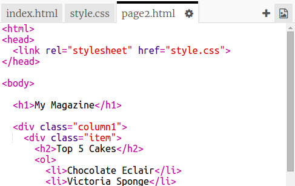

## Thêm một trang thứ hai

Hãy thêm một trang khác vào trang web tạp chí của bạn.

+ Thêm một trang mới vào dự án của bạn và đặt tên là `page2.html`:

+ Trang 2 sẽ khá giống với trang đầu tiên của tạp chí của bạn để bạn có thể sao chép html từ `index.html` và dán nó vào `page2.html`.

Lưu ý rằng cả hai trang đều sử dụng cùng `style.css` để chúng sẽ chia sẻ kiểu.

+ Thay đổi tiêu đề `<h1>` cho trang2:

+ Bây giờ bạn sẽ cần các liên kết giữa các trang của mình để bạn có thể đến trang 2 và quay lại trang trước.

Quay trở lại `index.html`. Thêm một liên kết bên trong một div trong cột 2 trong `index.html`:

+ Kiểm tra xem bạn có thể nhấp vào liên kết mới của bạn và chuyển đến trang 2 của tạp chí của bạn.