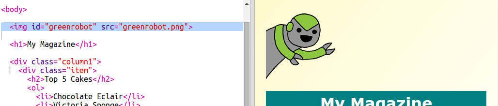

## Thêm một hình ảnh động

Hãy thêm một hình ảnh động vui nhộn vào tạp chí của bạn.

+ Truy cập `index.html` và bao gồm hình ảnh `greenrobot.png` ở đầu trang của bạn.

+ Bây giờ hãy thêm CSS để tạo hiệu ứng cho robot của bạn:

