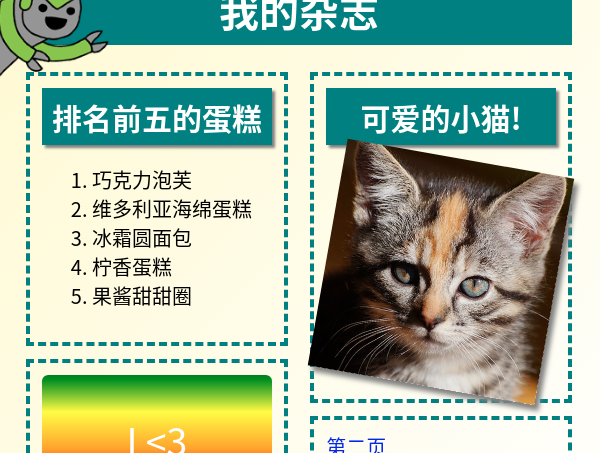

## 介绍

在这个项目中, 你会学到如何使用HTML和CSS来创建一个多页面的杂志网站, 网站包含两个页面布局. 你也会再次看到很多来自于其他项目中学习到的HTML和CSS技术.

  <iframe src="https://trinket.io/embed/html/a41e4e1c5c?outputOnly=true&start=result" width="600" height="505" frameborder="0" marginwidth="0" marginheight="0" allowfullscreen>
  </iframe>
  

### 俱乐部导师的附加信息

如果您需要打印本项目文件，请使用[合适的打印版本](https://projects.raspberrypi.org/en/projects/magazine/print)

## \--- collapse \---

## title: 编码俱乐部导师说明

## 介绍：

在这个项目中, 孩子们会学习如何创建两列的布局. 他们会回顾许多在其他项目中学过的HTML和CSS知识.

## 在线资源

我们推荐使用 [trinket](https://trinket.io/) 来在线编写 HTML & CSS。本项目包含以下 trinket：

* [“杂志”起点 -- jumpto.cc/web-magazine](http://jumpto.cc/web-magazine)

孩子们也可以使用该空白trinket [(jumpto.cc/html-blank)](http://jumpto.cc/html-blank)来编写他们的 HTML & CSS， 或者也可以使用trinket模板 [(jumpto.cc/html-template)](http://jumpto.cc/html-template)。

以下的trinket代码包含挑战的示范解决方案：

* ['杂志' 完成 -- trinket.io/html/a41e4e1c5c](https://trinket.io/html/a41e4e1c5c)

## 离线资源

如有需要，本项目可以[离线完成](https://www.codeclubprojects.org/en-GB/resources/webdev-working-offline/)。 您可以通过点击“项目资料”链接，访问本项目的资源。 此链接中的“项目资源” 部分，包含孩子们完成该项目所需的离线资源。 请确保每个孩子都可以访问这些资源。 这部分包含如下文件：

* intro/index.html
* template/template.html
* template/style.css
* magazine/index.html
* magazine/style.css
* magazine/script.js
* magazine/mutliple .png images

你也可以在 “志愿者资源'”部分找到该项目挑战的完整版本，里面包含：

* magazine-finished/index.html
* magazine-finished/style.css
* magazine-finished/script.js
* magazine-finished/kitten.jpg
* magazine-finished/recipe-finished.jpg
* magazine-finished/greenrobot.png
* magazine-finished/spacerobot.png

(上述所有资源均可下载为项目和志愿者`.zip`文件。)

## 学习目标

* 这个项目教会孩子们如何使用样式布局`float:`创建一个两栏的杂志. 也回顾了一些其他项目中涵盖的HTML和CSS细节知识. 给出的样例让孩子们可以完成项目, 即使他们没有学习过之前的项目. 

该项目涵盖了[Raspberry Pi数字制作课程](http://rpf.io/curriculum)中的以下内容 ：

* [设计基本的 2D 和 3D 资源](https://www.raspberrypi.org/curriculum/design/creator) 。

## 挑战

* "增加项目到左边栏" - 放置项目到浮动元素中;
* "添加返回到第一页的链接" - 在项目中创建两个页面的链接;
* "填写你的第二个页面" - 回顾 HTML & CSS;
* "增加另一个动画" - 回顾动画.

\--- /collapse \---

## \--- collapse \---

## title: 项目资源

## 项目资源

* [包含所有项目资源的.zip文件](resources/magazine-project-resources.zip)
* [包含所有“杂志”项目资源的在线 Trinket](http://jumpto.cc/web-magazine)
* [在线 Trinket 模板](http://jumpto.cc/trinket-template)
* [在线空白 Trinket 项目](http://jumpto.cc/trinket-blank)
* [template/index.html](resources/template-index.html)
* [template/style.css](resources/template-style.css)
* [intro/index.html](resources/intro-index.html)
* [intro/style.css](resources/intro-style.css)
* [magazine/index.html](resources/magazine-index.html)
* [magazine/style.css](resources/magazine-style.css)
* [magazine/script.js](resources/magazine-script.js)
* [magazine/kitten.jpg](resources/magazine-kitten.jpg)
* [magazine/recipe-final.png](resources/magazine-recipe-final.png)
* [magazine/greenrobot.png](resources/magazine-greenrobot.png)
* [magazine/firerobot.png](resources/magazine-firerobot.png)
* [magazine/spacerobot.png](resources/magazine-spacerobot.png)
* [magazine/dogrobot.png](resources/magazine-dogrobot.png)

## 俱乐部导师资源

* [包含所有完成项目资源的.zip文件](resources/magazine-volunteer-resources.zip)
* [在线已完成的Trinket项目](https://trinket.io/html/a41e4e1c5c)
* [magazine-finished/index.html](resources/magazine-finished-index.html)
* [magazine-finished/style.css](resources/magazine-finished-style.css)
* [magazine-finished/script.js](resources/magazine-finished-script.js)
* [magazine-finished/kitten.jpg](resources/magazine-finished-kitten.jpg)
* [magazine-finished/recipe-final.png](resources/magazine-finished-recipe-final.png)
* [magazine-finished/greenrobot.png](resources/magazine-finished-greenrobot.png)
* [magazine-finished/spacerobot.png](resources/magazine-finished-spacerobot.png)

\--- /collapse \---