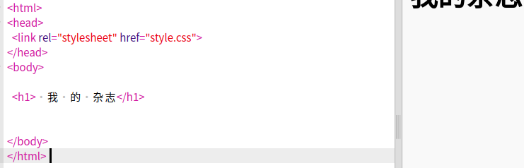
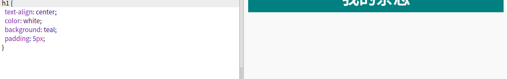
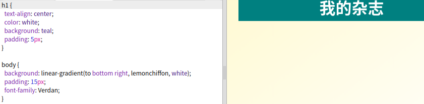

## 标题和背景

杂志样式网站在一个页面上经常有一些小的项目. 首先你会创建杂志的标题和背景.

+ 打开这个Trinket: <a href="http://jumpto.cc/web-magazine" target="_blank">jumpto.cc/web-magazine</a>。
    
    效果应该是这样：
    
    

+ 让我们添加标题.
    
    你可以思考你的杂志的更好的标题.
    
    

+ 你能设置标题的样式吗?
    
    这是一个例子, 但是你可以选择你自己的样式:
    
    

+ 现在让我使用gradient和选择字体创建杂志的有吸引力的背景.
    
    这里是一些示例样式, 提醒你如何创建倾斜度:
    
    