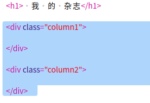
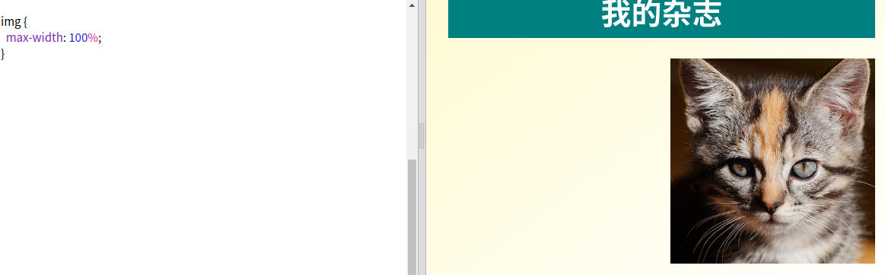

## 创建栏目

网站经常使用多个栏目. 让我们创建一个杂志使用的两栏布局.

+ 首先创建两个栏目`div`.
    
    增加高亮的HTML到`index.html`.
    
    

+ 现在设置栏目div的样式, 以便浮动到左侧并且其他的栏目浮动的右侧.
    
    
    
    每个栏目应该小于50%, 有一些空间.
    
    你需要在栏中添加一些内容以便看到效果.

+ 我们添加小猫的图片到第二栏的顶部.
    
    
    
    请注意，小猫图像位于页面中间的第二列
    
    看上去有点大!

+ 让我们使用`max-width:`使图片适合他们所在的容器.
    
    将下面的样式添加到`style.css`
    
    
    
    这会应用到杂志中的所有图片, 不仅仅是小猫.

+ 现在增加一个class`photo`到image, 以便你可以设置它的样式:
    
    

+ 并且设置图片样式增加阴影和扭转, 使得图片突出页面:
    
    
    
    做一些调整, 直到你喜欢这个效果.