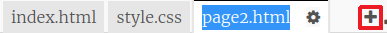
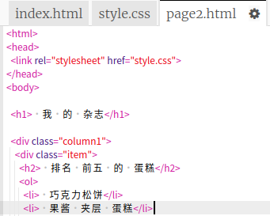
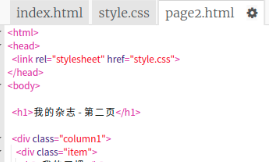
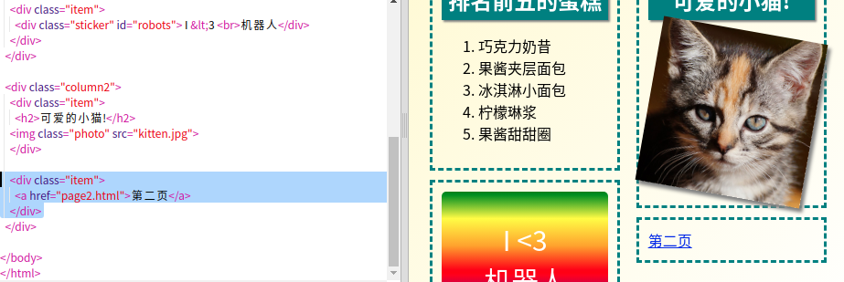

## 添加第二页

让我们添加另外一个页面到你的杂志网站.

+ 增加一个新的页面到你的项目并且起名`page2.html`:

+ 第二页和第一页相似, 你可以从`index.html`页面拷贝一个,改名为`page2.html`.

注意,所有的页面使用同一个`style.css`因此他们会共享样式.

+ 改变`<h1>`第二页的标题:

+ 现在你需要在你的页面中建立连接以便你可以从第二页回到前一页.

返回到 `index.html`. 在 `index.html`的第二栏的div内部加入一个link:

+ 测试一下你可以点击新连接跳转到杂志的第二页.