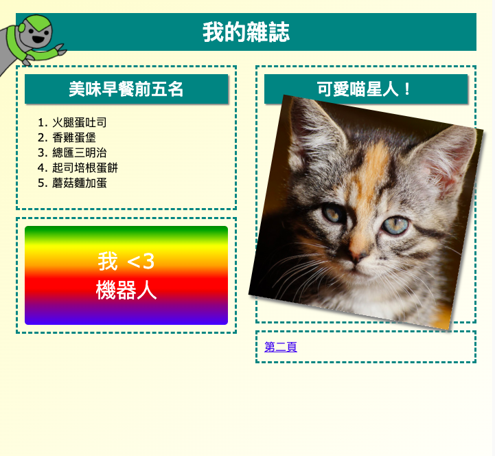

## 簡介

你會在這個專案中學習如何使用HTML和CSS，創建一本雜誌網站，並為雜誌設計各個不同的頁面。同時，還會重新熟悉在其他專案中，各種各樣的HTML和CSS程式碼。

  <iframe src="https://trinket.io/embed/html/021e12f333?outputOnly=true&start=result" width="600" height="505" frameborder="0" marginwidth="0" marginheight="0" allowfullscreen>
  </iframe>
  

### 提供教師的補充資訊

如果需要列印本專案，請使用 [友善列印](https://projects.raspberrypi.org/zh-TW/projects/magazine/print)。

--- collapse ---
---
title：給教師的補充筆記
---
## 介紹

本專案中，孩子們會學習如何在網頁中創建兩個欄位版面。同時，還會重新回顧其他專案中，學到的許多HTML & CSS程式碼。

## 線上資源

我們建議線上使用 [Trinket](https://trinket.io/) 編寫HTML & CSS 。本專案包含的 Trinkets 程式碼如下：

* [前往查看本專案《雜誌》的程式編碼 - jumpto.cc/web-magazine](http://jumpto.cc/web-magazine)

孩子們也能利用空白的Trinket[（jumpto.cc/html-blank）](http://jumpto.cc/html-blank)編寫自己的HTML & CSS，也可以使用這個Trinket模板[（jumpto.cc/html-template）](http://jumpto.cc/html-template)來建置網頁。

下列成品包含所有挑戰，為Trinket上專案的完成版：

* [《雜誌》成品 - trinket.io/html/021e12f333](https://trinket.io/html/021e12f333)

## 離線資源

依據個人喜好，本專案也能夠以[離線方式完成](https://www.codeclubprojects.org/en-GB/resources/webdev-working-offline/)。 你可以從下方的「專案資料」取得專案的相關資源。 「專案資料」包含學生以離線方式完成本專案，他們會需要用到的學習資源。 請確保每一個孩子都能取用得到所有資源副本。 本節包括以下文件：

* 前奏/ index.html的
* 模板/ template.html
* 模板/ style.css文件
* 雜誌/ index.html的
* 雜誌/ style.css文件
* 雜誌/的script.js
* magazine / mutliple .png圖片

你也可以在「志工相關資源」中找到包含挑戰的完整版專案，包括以下文件：

* 雜誌成品/ index.html的
* 雜誌成品/ style.css文件
* 雜誌成品/的script.js
* 雜誌成品/ kitten.jpg
* 雜誌成品/配方，finished.jpg
* 雜誌成品/ greenrobot.png
* 雜誌成品/ spacerobot.png

（以上所有資源也能以專案和志願者`.zip` 檔案作下載）。

## 學習目標

* 本專案教孩子使用 `float：`浮動語法創建兩欄位版面。 同時，還會更細節回顧其他專案中，學到的許多HTML & CSS程式碼。 這邊提供一些範例，即使孩子沒做過早期的專案，也能夠學習完成這個專案。 

本專案涵蓋 [Raspberry Pi數位創造課程](http://rpf.io/curriculum)的下列學習要素：

* [設計2D和3D的基本物件](https://www.raspberrypi.org/curriculum/design/creator)。

## 挑戰

* 「添加左欄內容」—寫入CSS浮動語法，創作欄位內容；
* 「添加回到第一頁的連結鈕」—在頁面之間創建連結；
* 「設計雜誌的第二頁」—再複習編寫一次HTML & CSS程式碼；
* 「加入另一個動畫」—再製作一次動畫。

--- /collapse ---

--- collapse ---
---
title：專案教材
---
## 專案資源

* [包含所有項目資源的.zip文件](https://rpf.io/p/zh-TW/magazine-go)
* [線上Trinket包含「雜誌」的所有專案資源](http://jumpto.cc/web-magazine)
* [線上Trinket模板](http://jumpto.cc/trinket-template)
* [在線空白飾品](http://jumpto.cc/trinket-blank)
* [模板/ index.html的](resources/template-index.html)
* [模板/ style.css文件](resources/template-style.css)
* [前奏/ index.html的](resources/intro-index.html)
* [前奏/ style.css文件](resources/intro-style.css)
* [雜誌/ index.html](resources/magazine-index.html)
* [雜誌/ style.css文件](resources/magazine-style.css)
* [雜誌/script.js](resources/magazine-script.js)
* [雜誌/ kitten.jpg](resources/magazine-kitten.jpg)
* [雜誌/recipe-final.png](resources/magazine-recipe-final.png)
* [雜誌/ greenrobot.png](resources/magazine-greenrobot.png)
* [雜誌/ firerobot.png](resources/magazine-firerobot.png)
* [雜誌/ spacerobot.png](resources/magazine-spacerobot.png)
* [雜誌/ dogrobot.png](resources/magazine-dogrobot.png)

## 教師資源

* [包含所有專案資源的.zip文件](https://rpf.io/p/zh-TW/magazine-go)
* [線上完成的Trinket專案](https://trinket.io/html/021e12f333)
* [雜誌成品/ index.html的](resources/magazine-finished-index.html)
* [雜誌成品/ style.css文件](resources/magazine-finished-style.css)
* [雜誌成品/script.js](resources/magazine-finished-script.js)
* [雜誌成品/ kitten.jpg](resources/magazine-finished-kitten.jpg)
* [雜誌成品/recipe-final.png](resources/magazine-finished-recipe-final.png)
* [雜誌成品/ greenrobot.png](resources/magazine-finished-greenrobot.png)
* [雜誌成品/ spacerobot.png](resources/magazine-finished-spacerobot.png)

--- /collapse ---