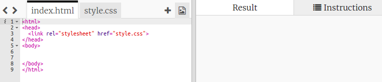
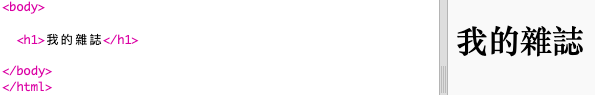
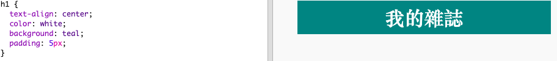
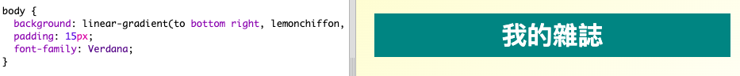

## 網頁標題與背景

像這樣以雜誌為風格的網站，版面通常會有許多不同欄位。第一步，先要為你的雜誌創建一個標題與背景。

+ 前往這個 Trinket 程式：<a href="http://jumpto.cc/web-magazine" target="_blank">jumpto.cc/web-magazine</a>。
    
    專案版面看起來像這樣︰
    
    

+ 我們為雜誌取個標題名稱。
    
    你可以為這本雜誌想個更有趣的名稱。
    
    

+ 你可以為雜誌設計一個標題嗎？
    
    這邊只是作範例，你可以選擇自己的風格：
    
    

+ 接下來我們在背景底圖作點有趣的變化並為雜誌選擇字體。
    
    背景若要作漸層變化，這邊提供程式碼的範例：
    
    