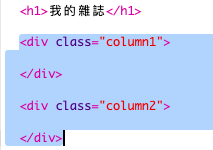
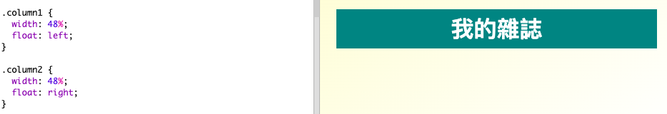
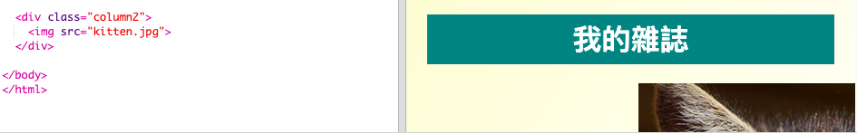
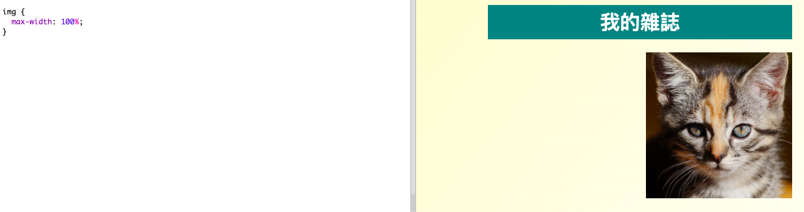

## 創建列

網站通常使用多個列。讓我們為您的雜誌創建一個兩列佈局。

+ 首先創建兩列 `div`s。
    
    將突出顯示的HTML添加到 `index.html`：
    
    

+ 現在設置列div的樣式，使一個浮動到左邊，另一個浮動到右邊。
    
    
    
    每列少於50％，因此有填充空間。
    
    您需要在列中添加一些內容才能看到效果。

+ 讓我們在第2列的頂部添加一張小貓圖片。
    
    
    
    請注意，在第二列中，小貓圖像位於頁面的大約一半處。
    
    雖然它有點大！

+ 讓我們使用 `max-width：` 來使圖像適合他們的容器。
    
    將以下樣式添加到 `style.css`。
    
    
    
    這適用於您在雜誌中使用的所有圖像，而不僅僅是小貓。

+ 現在將 `級照片` 添加到圖像中，以便您可以設置樣式：
    
    

+ 並設置圖像樣式以添加陰影和扭曲以使照片彈出頁面：
    
    
    
    進行一些更改，直到您喜歡結果。