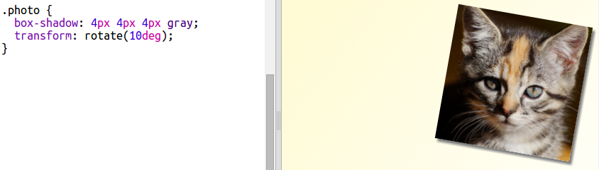

## 版面欄位設置

一般情況，網頁都會使用各種欄位藉此豐富頁面，一起來建個兩欄位的雜誌版面吧！

+ 第一步先寫出兩個 `div` 標籤。
    
    在`index.html`頁面中，寫入圖示裡畫標的HTML編碼：
    
    

+ 寫入CSS浮動語法，使左右各有一個欄位。
    
    
    
    兩欄各自不得大於版面的50％，為邊距預留空間。
    
    需要加點內容來看看顯示的效果。

+ 於第二欄上方加一張小貓圖。
    
    
    
    你會看到小貓圖被頁面卡掉了一半。
    
    圖有點太大了！

+ 接著使用 `max-width：` 調整圖片到適當大小。
    
    至`style.css`頁面寫入圖示中的CSS程式碼。
    
    
    
    此編碼適用你想使用在雜誌上的所有圖片。

+ 在img標籤內寫入 `photo` 類別，以便後續作樣式設計：
    
    

+ 為圖片加上陰影再稍微旋轉，頁面上看起來活潑生動一點：
    
    
    
    為雜誌嘗試各種搭配，找到屬於自己的風格。