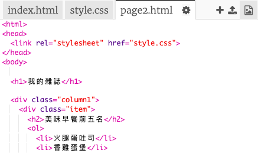
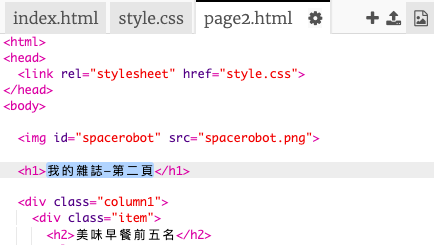
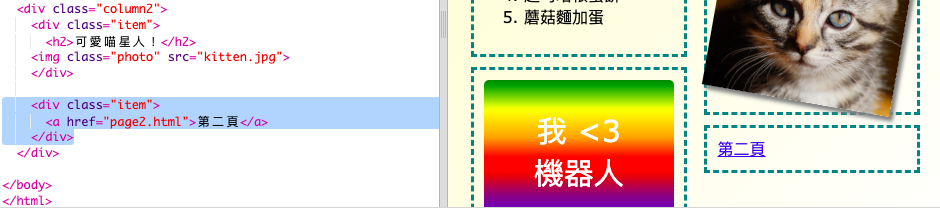

## 添加第二頁

讓我們在您的雜誌網站上添加另一頁。

+ 在項目中添加一個新頁面，並將其命名為 `page2.html`：

+ 第2頁將非常類似於雜誌的第一頁，因此您可以從 `index.html` 複製html並將其粘貼到 `page2.html`。

請注意，兩個頁面都使用相同的 `style.css` 因此它們將共享樣式。

+ 更改第</code> 的 `<h1>`標題：

+ 現在，您需要在頁面之間建立鏈接，以便進入第2頁並返回首頁。

返回 `index.html`。在 `index.html`中的第列div中添加一個鏈接：

<ul>
<li>測試您可以單擊新鏈接並轉到雜誌的第2頁。</li>
</ul>